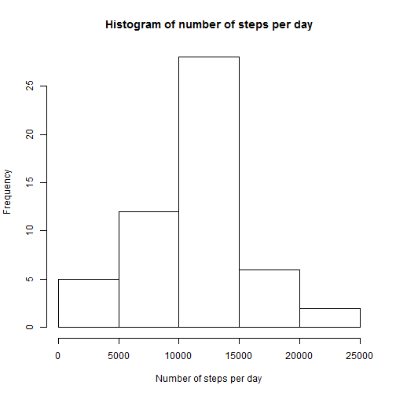
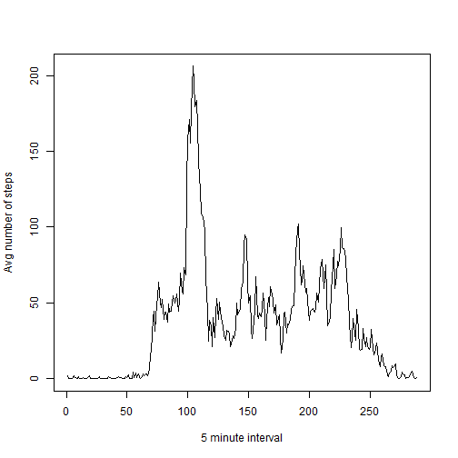
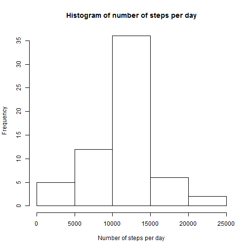

Reproducible Research - Peer Assessment 1
========================================================

## Loading and preprocessing data

Load data:


```r
data <- read.csv("activity.csv")
```


## What is mean total number of steps taken per day?

Find the total number of steps taken each day:


```r
stepsPerDay <- tapply(data$steps, data$date, FUN = sum)
```


Make a histogram:


```r
hist(stepsPerDay, main = "Histogram of number of steps per day", xlab = "Number of steps per day")
```

 


Find mean and median:

```r
mean(stepsPerDay, na.rm = TRUE)
```

```
## [1] 10766
```

```r
median(stepsPerDay, na.rm = TRUE)
```

```
## [1] 10765
```


## What is the average daily activity pattern?

Get data without NA:

```r
dataWithoutNA <- na.omit(data)
```


Get the average number of steps taken, averaged across all days:

```r
averageNumberOfSteps <- tapply(dataWithoutNA$steps, dataWithoutNA$interval, 
    FUN = mean)
```


Make a plot:

```r
plot(averageNumberOfSteps, type = "l", xlab = "5 minute interval", ylab = "Avg number of steps")
```

 


Which 5-minute interval, on average across all the days in the dataset,
contains the maximum number of steps:

```r
which.max(averageNumberOfSteps)
```

```
## 835 
## 104
```


## Imputing missing values

Calculate and report the total number of missing values in the dataset:

```r
nrow(data[rowSums(is.na(data)) > 0, ])
```

```
## [1] 2304
```


Impute missing values - use the mean for that 5-minute interval:


```r
restoredData <- data
restoredData[rowSums(is.na(data)) > 0, "steps"] <- averageNumberOfSteps[as.character(restoredData[rowSums(is.na(restoredData)) > 
    0, "interval"])]
```


Find the total number of steps taken each day:


```r
stepsPerDay <- tapply(restoredData$steps, restoredData$date, FUN = sum)
```


Make a histogram:


```r
hist(stepsPerDay, main = "Histogram of number of steps per day", xlab = "Number of steps per day")
```

 


Find mean and median:

```r
mean(stepsPerDay, na.rm = TRUE)
```

```
## [1] 10766
```

```r
median(stepsPerDay, na.rm = TRUE)
```

```
## [1] 10766
```


Because we used mean values as a substitute for the missing values, dates with 
restored values were put to the mean bar at the histogram.

## Are there differences in activity patterns between weekdays and weekends?

Add new factor variable (used russian localization) and make a plot:

```r
restoredData[, "date"] <- as.Date(restoredData[, "date"])
restoredData$weekend <- weekdays(restoredData$date) %in% c("суббота", "воскресенье")
numberOfSteps <- aggregate(steps ~ interval + weekend, data = restoredData, 
    FUN = "mean")
numberOfSteps$weekend <- factor(numberOfSteps$weekend, labels = c("weekday", 
    "weekend"))
library(lattice)
xyplot(steps ~ interval | weekend, data = numberOfSteps, type = "l", layout = c(1, 
    2), ylab = "Number of steps")
```

 

